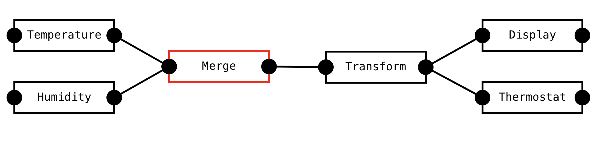

# Vertex Compute

Vertex compute aims to make it easy to build, deploy, scale, and monitor a system of reactive and scalable microservices.
A common design pattern in scalable systems is to have small independently scalable microservices that communicate over a distributed message queue.
This is a powerful and versatile design that comes up in many domains like finance, robotics, and data analysis.
The problem with these kinds of architectures is that they have many moving parts and are difficult to build and monitor.
Vertex Compute aims to simplify this process by presenting a framework in which to build these systems quickly and reliably.

## An example system

The architecture described in the previous paragraph may sound a bit abstract.
This image shows a simple system of different components communicating with each other. 
The goal of this system is to measure temperature and adjust a thermostat. 
Note that this example is deliberately simplified. It's probably not a good idea to have 6 different services communicating asynchronously with each other just to control one single thermostat.
Nevertheless, this example should be able to highlight the main parts of a Reactive Microservice Architecture.

The "temperature" and "humidity" are sources that get data from some external sensors. This may happen by polling a REST API, subscribing over a socket, or through some other way.
Both sources send their data to some kind of merge component. Note that both sources may get their data in very different ways.
They may also get their data in very different formats and with different frequencies. Both sources may also fail unexpectedly.
We do not want those factors to influence the rest of the system. 

The sources should normalize their data and pass it to the "Merge" component. 
This component receives input data from the sources and combines it into some aggregated representation.
It is also responsible for normalizing the frequency of the data and publishes exactly one output message per second.

The "transform" component transforms the input data into a more useful representation.
For example, it could take the rolling average of the last minute of input data.

The "display" and "thermostat" are sinks that receive data and perform some kind of side effect.
The "display" component sends data to a frontend over a websocket connection, where it can be displayed.
The "thermostat" controls the thermostat settings and may change the temperature.

## Characteristics
The example gives an idea of the characteristics of this kind of system. It has
1. Independent and isolated components that only do one thing and can be scaled independently.
2. Communication happens via asynchronous message passing (using one unified message format).
3. The complete system forms a Directed Acyclic Graph (DAG).

One way to build systems like this is to deploy each component as a separate service in kubernetes, and communicate through kafka.
This is a fine system, but it is complex enough that this is only feasible for larger organizations.
The goal of Vertex Compute is to make these kinds of systems as easy to build as a traditional monolith.

## Vertex Compute goals and characteristics
1. Components are actors
2. Components can be created, modified, and destroyed via an API.
3. Logging and tracing is built-in.
4. The system can be deployed as a cluster, and components can be moved between cluster members.
5. The complete system can be inspected through a UI.
6. Logging and metrics are integrated in the UI.
7. The system is built on top of [akka](https://akka.io) on the [JVM](https://en.wikipedia.org/wiki/Java_virtual_machine).
8. Component code and the system DAG can be changed without restarting the whole system.
9. Component code can be written in a way that is intuitive and reusable.
10. The system should have low latency.
11. The system should have high throughput that can be increased arbitrarily by horizontally scaling components.

