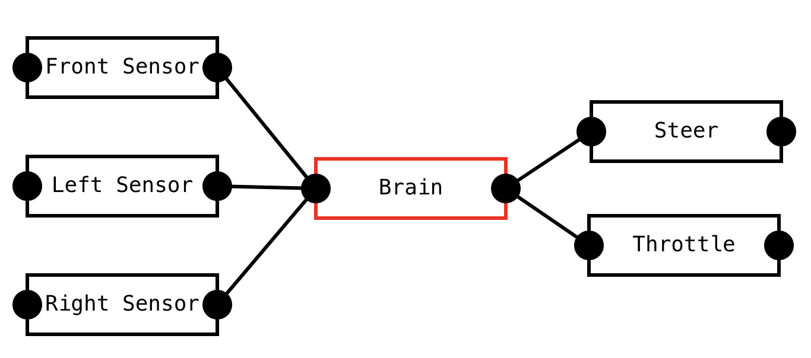

# Reactive System Design
Reactive systems are a widely used but also somewhat neglected class of software design.
Studying it shows the surprising similarities between VHDL, React, Apache Kafka, and Excel.
Understanding reactive systems may also be vital to understanding the direction that software design is trending towards.
So what are reactive systems exactly? Let's look at some examples first and distill definitions from those.

### The Climate System

Suppose we would like to build a backend for a climate system.
This image shows a simple system of different components communicating with each other.
The goal of this system is to measure temperature and adjust a thermostat accordingly.

The "temperature" and "humidity" are sources that get data from some external sensors. This may happen by polling a REST API (polling periodically), subscribing over a socket (receiving updates in change), or some other method entirely.
Both sources send their data to some kind of merge component. Note that both sources may get their data in very different ways.
They may also get their data in very different formats and with different frequencies. Both sources may also fail unexpectedly.
We do not want those factors to influence the rest of the system.

The sources should normalize their data input format and pass it to the "Merge" component.
This component receives input data from the sources and combines it into some aggregated representation.
It is also responsible for normalizing the frequency of the data and publishes exactly one output message per second.
The "transform" component transforms the input data into a more useful representation.
For example, it could take the rolling average of the last minute of input data.

The "display" and "thermostat" are sinks that receive data and do something with it.
The "display" component sends data to a web UI over a websocket connection, where it can be displayed.
The "thermostat" controls the thermostat settings and may change the temperature.

### The Robot Brain

Imagine a robot car with sensors in all directions. The objective of the robot car is to navigate a course.
A possible architecture could look like the picture above. The brain takes the 3 inputs and determines the
steer and throttle.

### The Synthesizer

### The Factory Belt Analogy

### Definitions
- The system forms a directed acyclic graph (DAG) of processing steps (components).
- When an update happens in a component, the update is propagated to all connected components.

### Effects
- Components are highly decoupled because they communicate through data updates (aka message passing) only.
- It becomes easy to decouple the execution of components themselves (and to achieve effortless parallelism, fault tolerance, and scalability).
- Component interfaces are unified, so it is possible to have a suite of metrics and management operations that work on any component.

### Reactive Microservices Architecture

### Actor systems

### Reactive Component Architecture

### Hardware Description Language

### Reactive Systems on the Frontend

### Excel

### Logic programming