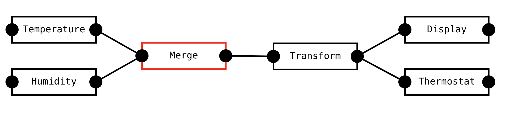

# Reactive System Design
Reactive systems are a widely used but also somewhat understudied type of system.
Studying it shows commonalities between seemingly very different software systems.
Understanding reactive systems may also be vital to understanding the direction that software design is trending towards.
So what are reactive systems exactly? Let's look at some examples first and distill definitions from those.

### The Climate System

Suppose we would like to build a backend for a climate system.
This image shows a simple system of different components communicating with each other.
The goal of this system is to measure temperature and adjust a thermostat accordingly.

The "temperature" and "humidity" are sources that get data from some external sensors. This may happen by polling a REST API (polling periodically), subscribing over a socket (receiving updates in change), or some other method entirely.
Both sources send their data to some kind of merge component. Note that both sources may get their data in very different ways.
They may also get their data in very different formats and with different frequencies. Both sources may also fail unexpectedly.
We do not want those factors to influence the rest of the system.

The sources should normalize their data input format and pass it to the "Merge" component.
This component receives input data from the sources and combines it into some aggregated representation.
It is also responsible for normalizing the frequency of the data and publishes exactly one output message per second.
The "transform" component transforms the input data into a more useful representation.
For example, it could take the rolling average of the last minute of input data.

The "display" and "thermostat" are sinks that receive data and do something with it.
The "display" component sends data to a web UI over a websocket connection, where it can be displayed.
The "thermostat" controls the thermostat settings and may change the temperature.

### React (and other frontend frameworks)
A frontend built with React forms a hierarchical tree structure of React components. On each component, it is 
possible to call the `setState` method. This will update the state of the component, triggering a re-render 
with the updated state. This render call will in turn update all child components. The child components also can 
receive the parents updated state through their `props`.

The way React works may seem very different from the climate system. However, the underlying process is very similar.
There are a number of components that form a tree hierarchy. A source component receives an update message. This 
update message triggers a re-render the component. This computation in turn triggers updates in all connecting 
components. 

### Excel (and other spreadsheets)
Another system that is reactive. Formulas are powerful because the can reference other cells which in turn can also 
be formulas. When one cell updates, all formulas that reference that cell need to be updated. So the change is 
propagated throughout the system through a DAG.

### VHDL (and other Hardware Description Languages)
In VHDL you define an entity with input and output gates. Outputs of one entity can be connected to inputs of other 
entities. Changing an input in a system propagates that change to connected entities.

### Logic programming

### Definitions
- The system forms a directed graph (usually acyclic) of processing steps (components).
- When an update happens in a component, the update is propagated to all connected components.

### What Now?
It is clear that many systems are reactive. The main programming model in the frontend is reactive. Business 
analysts that are wiring together a system with excel are using a system that is reactive. Electrical engineers use 
a completely reactive system when designing digital circuits.

It seems that only the backend engineers are stuck programming a model that is based on some other abstraction, the 
turing machine. This served us well when computation happens on a machine with a traditional von Neumann 
architecture. In practice this is rarely the case anymore. Yet all the most widely used programming languages are 
thin abstractions over the turing machine model. For a modern system that is inherently multithreaded a different 
paradigm is needed. This system should be reactive. 

### Effects
- Components are highly decoupled because they communicate through data updates (aka message passing) only.
- It becomes easy to decouple the execution of components themselves (and to achieve effortless parallelism, fault tolerance, and scalability).
- Component interfaces are unified, so it is possible to have a suite of metrics and management operations that work on any component.

### Reactive Microservices Architecture

### Actor systems

### Reactive Component Architecture